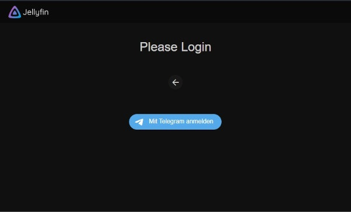
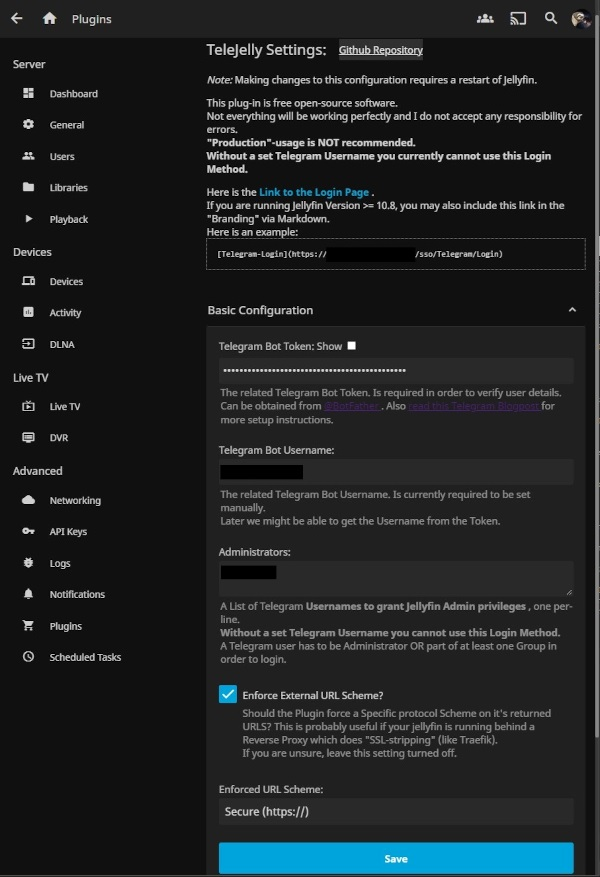
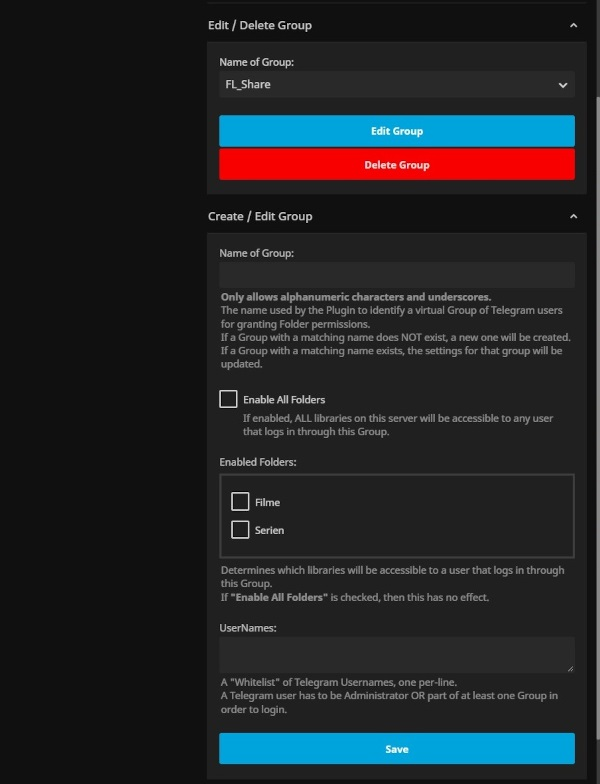

<h1 align="center">TeleJelly Plugin</h1>

A Plugin for logging into [Jellyfin](https://jellyfin.org/) using the [Telegram Login Widget](https://core.telegram.org/widgets/login) as "SSO" provider.

Allows for simple Group creation/editing/deleting in order to manage Admins/Users/Library-access.

Having a Telegram Username is mandatory.

Inspired by [jellyfin-plugin-ldapauth](https://github.com/jellyfin/jellyfin-plugin-ldapauth) and [jellyfin-plugin-sso](https://github.com/9p4/jellyfin-plugin-sso).

Created from [This Template](https://github.com/jellyfin/jellyfin-plugin-template)

## Scenario

0. a user wants to access Jellyfin
1. user sees the "Telegram-Login" Disclaimer Link on Default Login Page
2. user lands on the page "yourjellyfin.com/sso/Telegram/login"
3. Plugin shows a Page with a Single-Click "Telegram Login" button.
3.1 The Widget gets instructed to redirect to url on success: "yourfellyfin.com/sso/Telegram/confirm?user=123123&name=sdfsd.....&hash=asdasdasdasd"
4. When the button is clicked, The plugin redirects to the URL with filled parameters.
5. Plugin tries to validate the User data using custom Telegram logic.
6. On Success -> Auth & redirect to Jellyfin Dashboard
7. On Failure -> back to Login with Error Message (e.g. Invalid Data, not Whitelisted)

## Install

Currently only manual.

1. Download the 'latest' Version from Releases on the right
2. put it into `config/plugins/TeleJelly` folder
3. restart jellyfin

There is an example config included, but it will also get created automatically if you'd prefer editing the UI.

## Compile

You can also easily compile yourself if you dont trust the download.

1. `git clone https://github.com/hexxone/TeleJelly.git`
2. install [.NET6](https://dotnet.microsoft.com/en-us/download/dotnet/6.0)
3. run `publish.ps1`.

## Usage

Go to the configuration page and fill in the Bot-Token and Bot-Username first.

Aferwards you can add yourself into the "Administrators" list for full access, or create a Group.

Now you should be able to log in to jellyfin by visiting `yourjellyfin.com/sso/Telegram/login`.

If you are running Jellyfin Version >= 10.8, you may also include this link in the "Branding" via Markdown.

E.g.: `[Telegram-Login](https://jelly.fin/sso/telegram/login)`

## Features

- SSO Login page (at /sso/Telegram/Login)
  - styled in the
  - shows a "Back to Normal Login" button
  - shows error message if given
  - shows the Telegram Login Widget

- SSO Redirect page (at /sso/Telegram/Redirect)
  - checks the Telegram Auth data
  - if data is invalid -> redirect back to login with error
  - takes the Jellyfin Auth Response and loggs in the user
  - fancy loading animation

- Config page (reachable via Jellyfin Plugin Page)
  - allows setting the Telegram Bot Token & Name (required)
  - allows setting a List of Administrator Telegram Usernames (get full Access)
  - allows forcing an external Protocol Scheme (for problems with reverse Proxies)
  - allows Creating/Editing/Deleting a "virtual" management Group
    - Grants access to all OR specific Libraries for non-Administrators.
    - A user needs to be Admin OR part of at least ONE Group to Log-in.

## Known issues

If a User's profile picture fails to download even though the url is given (err 404), he has probably set it to private. This is weird behaviour by Telegram imho.

If a User were to change/sell his Username, a random person would possibly be able to use this Service, but having Names over ID's is much more convenient for Management.

## Screenshots

### Login Page

### Config Page

## Licensing

Licensing is a complex topic. This repository features a GPLv3 license template that can be used to provide a good default license for your plugin. You may alter this if you like, but if you do a permissive license must be chosen.

Due to how plugins in Jellyfin work, when your plugin is compiled into a binary, it will link against the various Jellyfin binary NuGet packages. These packages are licensed under the GPLv3. Thus, due to the nature and restrictions of the GPL, the binary plugin you get will also be licensed under the GPLv3.

If you accept the default GPLv3 license from this template, all will be good. However if you choose a different license, please keep this fact in mind, as it might not always be obvious that an, e.g. MIT-licensed plugin would become GPLv3 when compiled.

Please note that this also means making "proprietary", source-unavailable, or otherwise "hidden" plugins for public consumption is not permitted. To build a Jellyfin plugin for distribution to others, it must be under the GPLv3 or a permissive open-source license that can be linked against the GPLv3.
