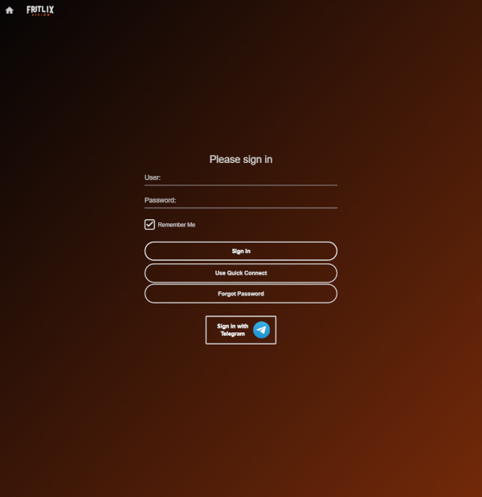
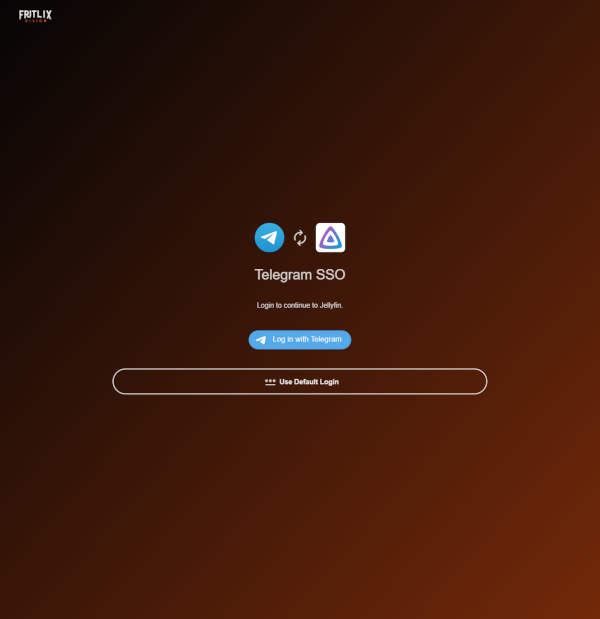
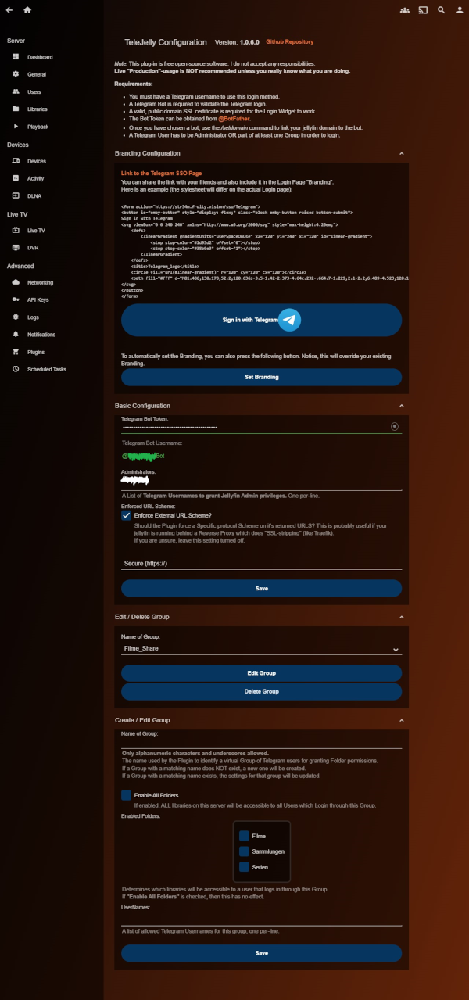

 
 

<h1 align="center">TeleJelly Plugin</h1>

A Plugin for logging into [Jellyfin](https://jellyfin.org/) using
the [Telegram Login Widget](https://core.telegram.org/widgets/login) as "SSO" provider.

Allows for simple Group creation/editing/deleting in order to manage Admins/Users/Library-access.

Inspired by [jellyfin-plugin-ldapauth](https://github.com/jellyfin/jellyfin-plugin-ldapauth)
and [jellyfin-plugin-sso](https://github.com/9p4/jellyfin-plugin-sso).

Created from [jellyfin-plugin-template](https://github.com/jellyfin/jellyfin-plugin-template).

## Contents

- [Usage](#usage)
- [Installation](#installation)
- [Configuration](#configuration)
- [Known issues](#known-issues)
- [Demo Video](#demo-video)
- [Screenshots](#screenshots)
- [Making Changes](#making-changes)

## Usage

1. User clicks the `Sign in with Telegram` Disclaimer Link on the Jellyfin Login Page
2. User lands on the page `/sso/Telegram`
3. Plugin shows a Page with embedded Telegram Login Widget.
4. When the button is clicked, Plugin validates User credentials using bot token.
    - On Success -> Authenticate & redirect User to Jellyfin Dashboard
    - On Failure -> Show Error Message (e.g. Invalid Data, not Whitelisted)

### Features

- SSO Login page (at `/sso/Telegram`)
    - styled similar to the regular login page
    - responsive / mobile capable
    - shows a "Back to Normal Login" button
    - shows the Telegram Login Widget
    - checks the Telegram Auth data against the backend
    - if data is invalid -> show error message
    - if data is valid -> takes the Jellyfin Auth Response and authenticates the user
    - loading animation
    - supports custom CSS

- Config page (reachable via Jellyfin Plugin Page)
    - requires setting the Telegram Bot Token
    - allows setting a List of Administrator Telegram Usernames (get full Access)
    - allows forcing an external Protocol Scheme (for reverse proxies like Traefik)
    - allows Creating/Editing/Deleting a "virtual" management Group
        - Grants access to all OR specific Libraries for non-Administrators.
        - _Note: A user needs to be Admin OR part of at least ONE Group to Log-in._

### Requirements

1. A Telegram Username is mandatory for all users who wish to use this Login method.
2. A valid, public SSL certificate is needed for the Login Widget to work (e.g. LetsEncrypt).
3. A Telegram Bot (token) is required to cryptograhpically validate the User Login credentials.

## Installation

You can choose between three options below.

### Option 1: Plugin Repository (easiest)

1. Add the repository: <https://raw.githubusercontent.com/hexxone/TeleJelly/dist/manifest.json>
2. install `TeleJelly` from the Plugin catalogue
3. restart jellyfin server

### Option 2: Download manually

If your sever doesn't have internet access, or you need older versions.

1. Download the [Release](https://github.com/hexxone/TeleJelly/releases/) (`TeleJelly_vX.X.X.zip`) for your correct Jellyfin Server TargetAbi
2. Extract the `.zip`-content into your jellyfin server folder `config/plugins/TeleJelly` (create it if non-existing)
3. Restart jellyfin server

### Option 3: Compile from source

Don't trust the downloads? You can also do it by yourself.

1. run command `git clone https://github.com/hexxone/TeleJelly.git` or download as zip.
2. install [.NET6 SDK](https://dotnet.microsoft.com/en-us/download/dotnet/6.0)
   or [.NET8 SDK](https://dotnet.microsoft.com/en-us/download/dotnet/8.0) (see the Tools section below)
3. navigate solution folder `cd ./TeleJelly`
4. run command `dotnet publish Jellyfin.Plugin.TeleJelly -c Release -v d`
5. you will get a file like `TeleJelly_vX.X.X-alpha.X.X.zip`
6. extract the `.zip`-content into your jellyfin server folder `config/plugins/TeleJelly` (create it if non-existing)
7. restart jellyfin server

## Configuration

1. Make a new Bot & get the Token via [@Botfather](https://t.me/BotFather)
2. Make sure to use the `/setdomain` command to link your jellyfin domain (needs valid SSL cert).
3. Go to the TeleJelly plugin configuration page and fill in the Bot-Token.
4. Add yourself into the "Administrators" list for full access or create an Administrator Group.
5. Now you should be able to log in via Telegram by visiting `/sso/Telegram`.
6. You may also include this link in the Login "Branding" via Markdown or HTML. See screenshots below.

## Bot Commands

- `/start` - Shows a welcome message.
- `/link` - Links your Telegram group to your Jellyfin group.
- `/register` - Registers a new user in your Jellyfin group.
- `/request <imdb>` - Requests a movie or series from IMDB-Id or URL.
- `/search <text>` - Searches for a media item in your Jellyfin server.
- `/stats` - Shows some statistics about your Jellyfin server and the plugin.
- `/unlink` - Unlinks your Telegram group from your Jellyfin group.
- `/userlist` - Lists all users in your Jellyfin group.

## Known issues

- This Login-method is intended for Desktop/Browser usage. It has not been tested to be working with official Jellyfin
  Apps. If you encounter problems, try signing in on a "real" browser instead and use the `Quick Connect` feature when
  possible. Besides that, there is very little you, or I can do.

- The `Sign in with Telegram` button will sometimes get hidden by Browser Plugins like "I don't like Cookies" or "UBlock
  Origin". Try disabling these on your Jellyfin domain and inform your users.

- If a User's profile picture fails to download even though the url is given (err 404), he has probably set it to
  private. In this case, the plugin will fall back to its default icon.

- If a User were to change/sell his Username, a random person would possibly be able to use this Service.
  However, having Names over ID's is much more convenient for Management.

- If your server is publicly reachable, make sure to take care of rate limiting with your reverse proxy;
  otherwise adversaries might be able to lag the system.

## Demo Video

_Note: Video & Screenshots are taken
with [my custom css theme](https://gist.github.com/hexxone/f00eecb130fa1ca12b3a4bc43d54e587) applied.
The Logo is AI-generated._

https://github.com/user-attachments/assets/48b908e7-c08e-4669-9d61-079c30cd229f

## Screenshots

Login Disclaimer

Login Page

Config Page

## Making Changes

### Tools

- [git](https://git-scm.com/downloads)
- [Visual Studio](https://visualstudio.microsoft.com/de/downloads/) or Rider IDE
- [.NET6](https://dotnet.microsoft.com/en-us/download/dotnet/6.0) for Jellyfin <= 10.8
- [.NET8](https://dotnet.microsoft.com/en-us/download/dotnet/8.0) for Jellyfin >= 10.9
- [Docker](https://www.docker.com/products/docker-desktop/) for local testing

### Dependencies

- [Telegram.Bot](https://github.com/TelegramBots/telegram.bot) telegram bot api interaction
- [ILRepack](https://github.com/gluck/il-repack) for packing all dependency dlls into one single plugin dll
- [MinVer](https://github.com/adamralph/minver) for automated Release-versioning via git tags

### Getting Started

1. Run `git clone https://github.com/hexxone/TeleJelly.git`
2. Open `TeleJelly.sln` file with Visual Studio or Rider IDE, restore Nuget packages
3. Copy `example.env`-file to `.env` and fill out the variables
4. Choose to run Profile `Docker Test`
5. Afterward Jellyfin with TeleJelly should be reachable under: <https://jellyfin.localhost:8443/>

> Note: the "invalid" SSL certificate warning is normal. You can however easily get a "real" one working with traefik.

### Contributing

When implementing a new feature, please name your commit messages in a meaningful way and refer to git best practices.

The plugin uses "MinVer" and git-tags for semantic versioning.

Most of the Versions (meta.json and manifest.json) get incremented automatically on release build,
**but** there are some places which have to be done manually - for example in the `config.html`.

When incrementing the version of Jellyfin, remember to set the correct `TargetAbi` version in `JellyfinPluginHelper`!

> Feel free to open a new Pull-Requests for useful additions and fixes.

### Release Process

This project uses a GitHub Actions workflow for automated releases (`dotnetcore.yml`). Here is how it ties into the release cycle:

1.  **Trigger**: The workflow is triggered manually via the **Actions** tab on GitHub.
2.  **Versioning**: It uses `MinVer` to calculate the version number based on the latest Git tag in the history.
3.  **Build**: The plugin is compiled using the .NET 8 SDK.
4.  **Repository Update**: It automatically updates the `manifest.json` in the orphaned `dist` branch. This allows Jellyfin instances to see the new version immediately via the repository URL.
5.  **GitHub Release**: Finally, it creates a new Release entry on GitHub, drafts the changelog, and attaches the compiled `.zip` file for manual download.

## Licensing

This project is licensed under the [GNU General Public License v3.0](LICENSE).