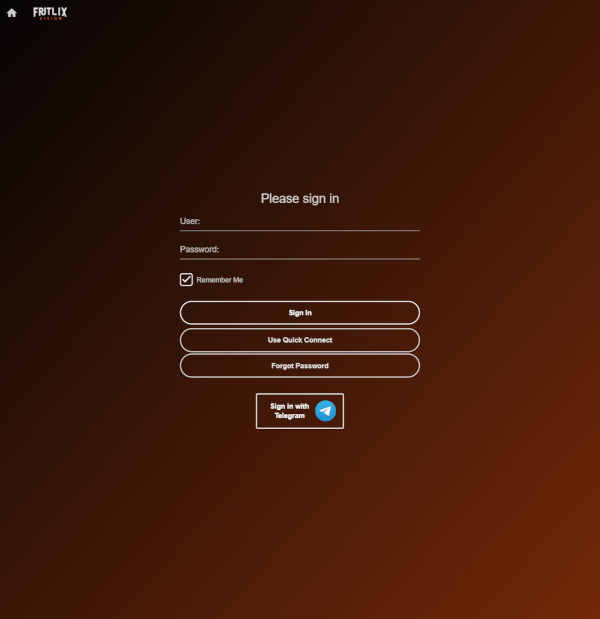
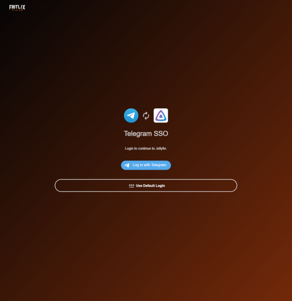
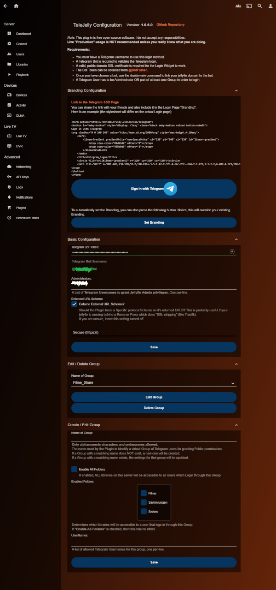

<h1 align="center">TeleJelly Plugin</h1>
<h4 align="center">
A <a href="https://core.telegram.org/widgets/login">Telegram Login Widget</a> "SSO"-provider for <a href="https://jellyfin.org/">Jellyfin</a>.
</h4>

---

 
 

---

TeleJelly is a Plugin for [Jellyfin](https://jellyfin.org/) which allows you and your users to Login using
the [Telegram Login Widget](https://core.telegram.org/widgets/login) as a "Single Sign On" provider.

The plugin allows for simple Group creation/editing/deleting in order to manage Admins, Users and Library-access.

Inspired by [jellyfin-plugin-ldapauth](https://github.com/jellyfin/jellyfin-plugin-ldapauth) and [jellyfin-plugin-sso](https://github.com/9p4/jellyfin-plugin-sso).
Created from [jellyfin-plugin-template](https://github.com/jellyfin/jellyfin-plugin-template).

---

## Contents

- [Usage](#usage)
    - [Features](#features)
    - [Requirements](#installation---usage-requirements)
- [Telegram Bot Interaction](#bot-interaction)
    - [Events](#bot-events)
    - [Notifications](#bot-notifications)
    - [Commands](#bot-commands)
    - [Inline Search](#inline-search)
- [Demo Video](#demo-video)
- [Installation](#installation)
- [Configuration](#configuration)
- [HTTPS / Reverse Proxy](#https--reverse-proxy)
- [Known issues](#known-issues)
- [Documentation](./TeleJelly/docs/README.md)
- [How to Contribute](./TeleJelly/docs/Contributing.md)

---

## Usage

1. User clicks the `Sign in with Telegram` Disclaimer Link on the Jellyfin Login Page
2. User lands on the page `/sso/Telegram`
3. Plugin shows a Page with an embedded Telegram Login Widget.
4. When the button is clicked, Plugin validates User credentials using bot token.
    - On Success → Authenticate & redirect User to Jellyfin Dashboard
    - On Failure → Show Error Message (e.g. Invalid Data, not Whitelisted)

### Features

- SSO Login page (at `/sso/Telegram`)
    - styled similar to the regular login page
    - responsive / mobile capable
    - shows a "Back to Normal Login" button
    - shows the Telegram Login Widget
    - checks the Telegram Auth data against the backend
    - if data is invalid → show an error message
    - if data is valid → takes the Jellyfin Auth Response and authenticates the user
    - loading animation
    - supports custom CSS

- Config page (reachable via Jellyfin Plugin Page)
    - requires setting the Telegram Bot Token
    - allows setting a List of Administrator Telegram Usernames (get full Access)
    - allows forcing an external Protocol Scheme (for reverse proxies like Traefik)
    - allows Creating/Editing/Deleting a "virtual" management Group
        - Grants access to all or specific Libraries for non-Administrators.
        - _Note: A user needs to be Admin OR part of at least ONE Group to Log in._
        - _Important: If "Sync Usernames" is disabled, you must manually add every Telegram Username to the list for
          them to be able to log in._

- Extensive Bot-Commands and configuration options
    - Search for media on the server, get detailed results displayed in Telegram, with direct links
    - Request new media for the server from the Owner via IMDB-Id
    - Get Server Status and media info
    - Several administrative commands
    - **(⚠️ WIP)** Fully integrated and automated Download-Pipeline 
        - have you ever thought "why is piracy so annoying and time-consuming" ? This might be for you. 
        - Primary Goal: Automate **everything** from "IMDB request" to "media on the server"
        - Secondary Goal: dont go to Jail, because everything is tunneled through a VPN
        - Automate searching for the requested IMDB-ID / Title + Year
        - Gather, de-duplicate and score Search results from multiple sites
        - Automatically select the best download(s) with custom download-scoring engine
        - Support all kinds of downloads via JDownloader & Torrent
        - Automatically unpack, decrypt & move download files to their correct destination Library
        - Automatically get the Metadata in JellyFin & Enrich with IMDB-Id
        - Send a notification to the Users in Telegram & remove the request

### Installation- & Usage Requirements

1. A Telegram Username is mandatory for all users who wish to use this Login method.
2. A valid, public SSL certificate is needed for the Login Widget to work (e.g. LetsEncrypt).
3. A Telegram Bot (token) is required to cryptographically validate the User Login credentials.

---

## Bot Interaction

The Telegram bot will only listen to commands, send notifications, and sync usernames if the `Enable bot service`
checkbox is **activated** on the configuration page and a **valid bot token** is set.

If the checkbox is **not activated**, you can still log in with configured groups, but nothing else will work.

> **Troubleshooting:** If the bot stops responding, you can restart the background service by unchecking
`Enable bot service` -> Save -> checking it again -> Save.

### Bot Events

If a Telegram-group is successfully linked to a TeleJelly-group, the bot will listen for chat events:

- Telegram only sends the membership updates needed for automatic syncing when the bot is an administrator in that group.
- User joins chat && `Sync Usernames` enabled -> User gets added to TeleJelly group automatically if he has a Username
  set.
- User left chat && `Sync Usernames` enabled -> User gets removed from TeleJelly group automatically if he has a
  Username set.

### Bot Notifications

If a Telegram-group is successfully linked to a TeleJelly-group **AND** `Notify New Content` is enabled, the bot can
send a notification if new Content is being
added to the Jellyfin server.

This currently includes: `Movies`, `Series`, `Seasons`, `Episodes`.

If "new content" is being detected, the bot will check if the Metadata is already complete (IMDb, Banner, etc.).

- If the metadata is complete, the bot sends a "rich" notification with all important info about the Item to all Groups
  that have access to the Item.
- If the metadata is not complete, wait for 24 hours before sending the notification anyway with incomplete metadata.

### Bot Commands

- `/start` - Shows a welcome message.
- `/link` - Links your Telegram group to your Jellyfin group.
- `/register` - Registers a new user in your Jellyfin group.
- `/request <imdb>` - Requests a movie or series from IMDB-Id or URL.
- `/search <text>` - Searches for a media item in your Jellyfin server.
- `/stats` - Shows some statistics about your Jellyfin server and the plugin.
- `/unlink` - Unlinks your Telegram group from your Jellyfin group.
- `/userlist` - Lists all users in your Jellyfin group.

**Notice:** Certain commands like `/link` are only available to TeleJelly "Admins" or might give additional info to
"Admins" like the `/stats` command.

### Inline Search

The bot supports inline queries, allowing users to search for media directly in any Telegram chat by typing `@YourBotUsername search query`.

#### Setup

To enable inline search, you need to configure it in **two places**:

1. **BotFather**: Send `/setinline` to [@BotFather](https://t.me/BotFather), select your bot, and set a placeholder text (e.g., "Search for movies and series...").
2. **TeleJelly Settings**: Enable the "Enable Inline Queries" checkbox on the TeleJelly configuration page and save.

#### How It Works

- Users type `@YourBotUsername` followed by a search query in any Telegram chat
- Results appear as inline suggestions with title, year, and media type
- Clicking a result sends a message with a "Watch in Jellyfin" button linking to the media

#### Permissions

- Only users who are **Admins** or **members of at least one TeleJelly group** can use inline search
- Each user only sees media from libraries they have access to (based on their group memberships)
- Unauthorized users receive no results

#### Security Considerations

> **Important:** When inline search is enabled, authorized users can search and share Jellyfin media links in **any** Telegram chat - including private chats, other groups, and channels that are **not linked** to TeleJelly.
>
> This means:
> - Media titles and Jellyfin URLs may be visible to people outside your TeleJelly-managed groups
> - Users could accidentally or intentionally share your server's media catalog with outsiders
> - The inline search works globally across Telegram, not just in linked groups
>
> **Only enable this feature if you trust all users in your TeleJelly groups** and understand that they can share search results anywhere on Telegram.

---

## Demo Video

_Note: Video & Screenshots are taken
with [my custom CSS theme](https://gist.github.com/hexxone/f00eecb130fa1ca12b3a4bc43d54e587) applied.
The Logo is AI-generated._

https://github.com/user-attachments/assets/48b908e7-c08e-4669-9d61-079c30cd229f

---

## Screenshots (outdated)

Login Disclaimer

Login Page

Config Page

---

## Installation

You can choose between three options below.

### Option 1: Plugin Repository (easiest)

1. Add the repository: <https://raw.githubusercontent.com/hexxone/TeleJelly/dist/manifest.json>
2. install `TeleJelly` from the Plugin catalogue
3. restart Jellyfin server

### Option 2: Download manually

If your sever doesn't have internet access, or you need older versions.

1. Download the [Release](https://github.com/hexxone/TeleJelly/releases/) (`TeleJelly_vX.X.X.zip`) for your correct
   Jellyfin Server TargetAbi
2. Extract the `.zip`-content into your Jellyfin server folder `config/plugins/TeleJelly` (create it if non-existing)
3. Restart Jellyfin server

### Option 3: Compile from source

Don't trust the downloads? You can also do it by yourself.

1. run command `git clone https://github.com/hexxone/TeleJelly.git` or download as zip.
2. install [.NET SDK](https://dotnet.microsoft.com/en-us/download/dotnet) (see [Docs](#documentation) for the
   correct Version)
3. navigate solution folder `cd ./TeleJelly`
4. run command `dotnet publish Jellyfin.Plugin.TeleJelly -c Release -v d`
5. you will get a file like `TeleJelly_vX.X.X-alpha.X.X.zip`
6. extract the `.zip`-content into your Jellyfin server folder `config/plugins/TeleJelly` (create it if non-existing)
7. restart Jellyfin server

For local development and download-manager testing, the bundled Docker stack now lives in [TeleJelly/docker-compose.yml](./TeleJelly/docker-compose.yml):

- Start the local stack with `cd TeleJelly && docker compose up -d`
- Start the same stack with the HTTPS Traefik example via `cd TeleJelly && docker compose --profile proxy up -d`

---

## Configuration

1. Make a new Bot & get the Token via [@Botfather](https://t.me/BotFather)
2. Make sure to use the `/setdomain` command to link your Jellyfin domain (needs valid SSL cert).
3. Go to the TeleJelly plugin configuration page and fill in the Bot-Token.
4. (Optional) Fill in the "Server Domain and Base URL" if you want the bot to use a specific URL in messages.
5. Add yourself into the "Administrators" list for full access or create an Administrator Group.
6. Now you should be able to log in via Telegram by visiting `/sso/Telegram`.
7. You may also include this link in the Login "Branding" via Markdown or HTML. The configuration page provides a *
   *ready-to-copy code snippet** for this. See screenshots below.

### Group Setup & Linking

To give other users access without making them Admins:

1. Create a new Group on the TeleJelly Config page (e.g., "Friends").
2. Add the Bot to your corresponding Telegram Group and promote it to an administrator if you want automatic join/leave syncing.
3. Run `/link` inside that Telegram Group to connect it to the TeleJelly Group.
4. If "Sync Usernames" is enabled, users joining the chat are automatically added to the plugin access list.
5. `/register` remains useful as a manual backfill for users who were already in the chat before linking or before sync was enabled.

---

## HTTPS / Reverse Proxy

If Telegram login returns successfully but Jellyfin stays on the login page, loops back to the login screen, or shows a generic connection failure, the problem is usually a mismatch between the public HTTPS URL, the BotFather domain, and the URL TeleJelly generates for the callback flow.

Use this checklist:

1. Expose Jellyfin on one public HTTPS URL and make sure users always use that same host name.
2. Run `@BotFather` -> `/setdomain` and set the exact external host name that serves Jellyfin.
3. In the TeleJelly config page, set `Server Domain and Base URL` to that same external URL, including any base path from your reverse proxy.
4. If your reverse proxy terminates TLS and forwards plain HTTP to Jellyfin, set `Enforce External URL Scheme` to `https`.
5. Confirm the browser address bar still shows your public `https://.../sso/Telegram` URL during the full login roundtrip and does not switch to `http://`, a container host, or an internal LAN-only name.
6. If you use Traefik, Nginx, or Caddy with additional auth/rate-limit middleware, ensure the `/sso/Telegram` route is forwarded cleanly and that Jellyfin still sees the original host.

Common symptoms of a bad setup:

- Telegram login widget loads, but the final redirect silently lands back on the login page.
- Jellyfin reports a generic "connection failure" after Telegram authentication succeeded.
- The login URL shown in the TeleJelly config page points to the wrong host, wrong scheme, or misses the reverse-proxy base path.

---

## Known issues

- This Login-method is intended for Desktop/Browser usage. It has not been tested to be working with official Jellyfin
  Apps. If you encounter problems, try signing in on a "real" browser instead and use the `Quick Connect` feature when
  possible. Besides that, there is very little you, or I can do.

- The `Sign in with Telegram` button will sometimes get hidden by Browser Plugins like "I don't like Cookies" or "UBlock
  Origin". Try disabling these on your Jellyfin domain and inform your users.

- If a User's profile picture fails to download even though the url is given (err 404), he has probably set it to
  private. In this case, the plugin will fall back to its default icon.

- If a User were to change/sell his Username, a random person would possibly be able to use this Service.
  However, having Names over ID's is much more convenient for Management.

- If your server is publicly reachable, make sure to take care of rate limiting with your reverse proxy;
  otherwise adversaries might be able to lag the system.

---

## [Documentation](./TeleJelly/docs/README.md)

## [How to Contribute](./TeleJelly/docs/Contributing.md)

## Licensing

This project is licensed under the [GNU General Public License v3.0](LICENSE).
